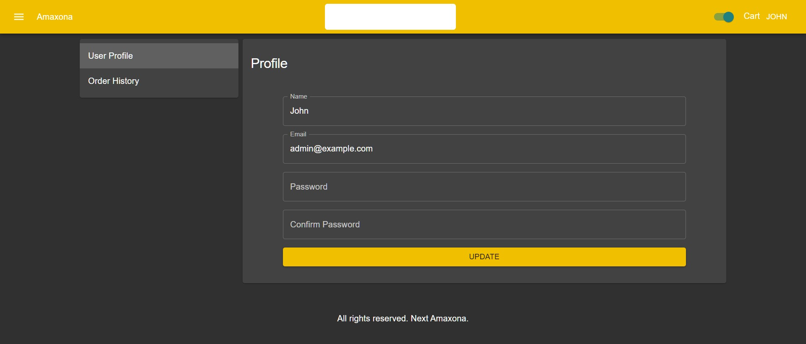

# Next Amaxona
Build ECommerce Website Like Amazon by Next.js
 - Source Code    :  https://github.com/JenuJari/nextjs-amaxona

## What is included
 - NextJS basics like setting up project, navigating between pages and data fetching
 - NextJS advanced topics like dynamic routing, image optimization,  SSG and SSR
 - MaterialUI framework to build responsive website using custom theme, animation and carousel
 - ReactJS including decomposing components, context API and hooks
 - Next Connect package to build backend API
 - MongoDB and Mongoose to save and retrieve data like products, orders and users
 - PayPal developer api to make online payment


## Run it Locally
```
$ git clone https://github.com/JenuJari/nextjs-amaxona
$ cd nextjs-amaxona
$ npm install
$ npm run dev
$ Open http://localhost:3000/api/seed
$ Open http://localhost:3000
```
---

## Screenshots

Followings are screnshots of ecommerce app various pages

- Dashbord


- Product


- Sidebar


- Filter and Search


- Cart


- Checkout


- Order Success


- Profile and order history

